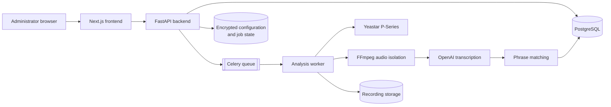

# Yeastar Call Analyzer

Yeastar Call Analyzer is a single-administrator application for retrieving
Yeastar P-Series calls, isolating operator speech, transcribing Greek audio,
and finding configured phrases. It contains no demo provider, seeded business
records, synthetic statistics, or runtime fixtures. If an external integration
is not configured, the affected actions remain unavailable and the interface
shows its real configuration state.

[](#3-local-deployment)
[](backend/app/main.py)
[](frontend/)
[](#verification-scope)

## Explore

[Requirements](#1-requirements) | [Local deployment](#3-local-deployment) | [Production](#4-production-deployment) | [Yeastar setup](#5-yeastar-api-configuration) | [Analysis workflow](#11-running-an-analysis) | [Troubleshooting](#16-troubleshooting)

## Architecture at a Glance



<details>
<summary><strong>Operational safety model</strong></summary>

Only the frontend is exposed publicly. The backend, PostgreSQL, and Redis stay on the private Compose network. External actions remain disabled until their integrations are configured, credentials are encrypted at rest, and retries are bounded by PBX and transcription-provider limits.

</details>

## 1. Requirements

- Docker Engine 26 or newer with Docker Compose v2
- A Yeastar P-Series PBX with OpenAPI enabled and CDR API v2 support
- An OpenAI API key with access to the configured transcription models
- HTTPS for production access
- Enough persistent disk space for PostgreSQL and recordings awaiting processing

FFmpeg and FFprobe are installed in the backend image; they are not required on
the host when Docker is used.

## 2. Environment variables

Copy `.env.example` to `.env` and set at least:

```bash
cp .env.example .env
```

- `APP_SECRET_KEY`: a random value of at least 32 bytes. For example,
  `openssl rand -hex 32`.
- `ADMIN_EMAIL` and `ADMIN_PASSWORD`: the only administrator credentials.
- `POSTGRES_PASSWORD`: a new database password, and `DATABASE_URL` using that
  same password (for example,
  `postgresql+psycopg://app:<same-password>@postgres:5432/yeastar`).
- `FRONTEND_ORIGIN`: the exact browser origin, without a trailing slash.

Yeastar and OpenAI values may remain empty while the application is initially
set up. Login and local screens still work, while external processing actions
stay disabled. Connection details and an OpenAI API key can be entered later
in **Settings**; UI-managed credentials are encrypted in persistent Redis and
are never stored in PostgreSQL.

For local HTTP testing, set `SECURE_COOKIES=false`. Production deployments must
use HTTPS and `SECURE_COOKIES=true`.

The remaining settings are documented inline in `.env.example`. The default
display timezone is `Europe/Athens`; database timestamps remain UTC.

## 3. Local deployment

After creating `.env`:

```bash
docker compose up --build
```

Open `http://localhost:3000`. Health endpoints are available through the same
frontend origin, for example `http://localhost:3000/api/health`. The backend is
kept inside the Compose network and is not published directly on the host.

To stop the application without deleting data:

```bash
docker compose down
```

Do not add `-v` unless you intentionally want to delete the local database,
Redis data, and stored recordings.

## 4. Production deployment

Run the Compose stack on a private host behind a TLS-terminating reverse proxy.
Expose the frontend only; restrict backend, PostgreSQL, and Redis to the Compose
network. Set `FRONTEND_ORIGIN` to the public HTTPS origin, keep
`SECURE_COOKIES=true`, use a strong database password, and provide secrets from
the deployment platform rather than committing a `.env` file.

Persist and back up the `postgres_data`, `redis_data`, and `app_storage`
volumes. Limit access to the host because recordings, transcripts, and
encrypted integration state may contain sensitive data.

The stack starts one Celery worker with concurrency one. The transcription
semaphore separately observes `MAX_PARALLEL_TRANSCRIPTIONS`. Increase worker
capacity only after confirming PBX recording-download and OpenAI rate limits.

## 5. Yeastar API configuration

### IT setup checklist

Complete this checklist before entering credentials:

1. Confirm Yeastar edition.
2. Confirm firmware version.
3. Enable Integrations > API.
4. Obtain Client ID and Client Secret.
5. Confirm the correct PBX API URL and port.
6. Add the application server's public IP to the API allowlist when IP restriction is enabled.
7. Confirm the server IP is not currently blocked.
8. Confirm permission to read extensions.
9. Confirm permission to read CDRs.
10. Confirm permission to read and download recordings.
11. Confirm recording is enabled.
12. Confirm the PBX recording format.
13. Prefer WAV when possible.

The required, case-sensitive configuration contract is:

```json
{
  "Name": "",
  "Settings": {
    "BaseUrl": "",
    "ClientId": "",
    "ClientSecret": "",
    "DateFormat": "MM/dd/yyyy HH:mm:ss",
    "PageSize": 500,
    "IgnoreSslErrors": true
  }
}
```

These values map to `YEASTAR_NAME`, `YEASTAR_BASE_URL`,
`YEASTAR_CLIENT_ID`, `YEASTAR_CLIENT_SECRET`, `YEASTAR_DATE_FORMAT`,
`YEASTAR_PAGE_SIZE`, and `YEASTAR_IGNORE_SSL_ERRORS`. `BaseUrl` must contain
only the scheme, host, and optional port, for example
`https://pbx.example.com:8088`. Do not include an API path, query string,
credentials, or tokens in that value.

The same fields can be entered or updated in **Settings** after sign-in. A
saved UI configuration is encrypted in persistent Redis and takes precedence
over the Yeastar environment defaults. Existing Client ID and Client Secret
values are never returned to the browser; leave either field blank to keep it.

`YEASTAR_IGNORE_SSL_ERRORS` replaces the earlier inverse
`YEASTAR_VERIFY_SSL` setting; do not configure both. When it is `true`,
certificate verification is disabled only for the Yeastar client and Settings
shows a warning. OpenAI and all other HTTPS clients continue to verify TLS.
Prefer installing the PBX's internal CA and setting this value to `false`.

HTTPS is required by default. Plain HTTP is accepted only when
`YEASTAR_ALLOW_HTTP=true` is deliberately set for a trusted internal network.
Do not enable it for an internet-routed PBX. The API paths, request timeouts,
token refresh skew, page size, and single bounded transient retry are listed in
`.env.example`; keep the supplied versioned paths unless IT confirms a required
change. The configured `.NET`-style date format distinguishes `MM` (month) from
`mm` (minute). A supported date/time format detected from the PBX takes
precedence over that fallback.

Add or change connection details in **Settings**, save them, then use **Test
connection**. No application restart is required. Credential changes never
cause automatic authentication. The local status and configuration-validation
checks also make no PBX request. A test performs no more than one initial
authentication, reads only PBX information, verifies one extension result and
one CDR v2 result when supported, and never downloads a recording.

### Token and connection safety

- The application reuses one shared token lifecycle across the API, every
  worker, operator synchronization, call searches, and recording downloads.
- Ordinary API calls do not create new tokens. Container startup, migrations,
  health checks, page loads, and status polling never authenticate to Yeastar.
- Shared token state is encrypted before it is stored in persistent Redis AOF
  storage, and access-token refresh preserves and replaces the latest refresh
  token safely.
- The application stops after one rejected credential attempt. It does not
  automatically retry invalid credentials or open an uncontrolled fallback
  loop.
- When the phone system blocks the server, do not keep testing. The
  administrator must contact IT to remove the block. For an allowlist failure,
  ask IT to add the application server's public IP.
- A deliberate **Test connection** is the only action that may retry after a
  protected connection failure. Frequent manual testing is unnecessary once
  the status is connected.
- **Reset connection** attempts one revocation, clears the shared local
  connection state, and requires a new manual test. Ordinary service shutdown
  does not revoke the shared connection.

The safe configuration endpoint preserves the JSON property casing but returns
only configuration markers for Client ID and Client Secret. It never returns
their values. Status, validation, and health responses never expose credentials,
tokens, Redis keys, token expiry times, or token-bearing URLs.

The client uses Yeastar's v1 token, system, extension, and recording interfaces
with the v2 CDR interfaces. Temporary recording download URLs remain on the
server and are validated before use. See the official Yeastar
[token](https://help.yeastar.com/en/p-series-software-edition/developer-guide/get-access-token.html),
[CDR v2](https://help.yeastar.com/en/p-series-software-edition/developer-guide/search-specific-cdr-v2.html),
and [recording](https://help.yeastar.com/en/p-series-software-edition/developer-guide/download-a-recording-file.html)
documentation.

No live PBX connection has been verified for this repository. That claim can
be made only after real credentials are supplied and a live **Test connection**
succeeds.

Yeastar AI transcript endpoints are treated as an optional Software Edition
capability; the application does not assume they exist on Appliance Edition.
For a one-to-one call with Yeastar stereo-separated recording enabled, the
application follows Yeastar's documented caller-left/callee-right channel
mapping. Queue, transferred, multi-leg, and otherwise ambiguous calls always
fall back to diarization instead of guessing. See Yeastar's official
[stereo-separated recording guidance](https://help.yeastar.com/en/p-series-software-edition/administrator-guide/enable-stereo-separated-recording-left-right-channel.html).

## 6. OpenAI configuration

In **Settings**, use the **OpenAI transcription** section to add or replace the
API key, then use **Test OpenAI connection**. The key is encrypted in
persistent Redis, is never returned to the browser, and takes effect without a
restart. `OPENAI_API_KEY` remains an optional deployment fallback when no
UI-managed key has been saved. The defaults are:

```env
OPENAI_TRANSCRIPTION_MODEL=gpt-4o-transcribe
OPENAI_DIARIZATION_MODEL=gpt-4o-transcribe-diarize
TRANSCRIPTION_LANGUAGE=el
```

The standard model is used when operator audio is safely isolated. The
diarization model is used only when channel assignment cannot be established;
unknown speakers are not automatically classified as operators. The
application builds a vocabulary prompt from configured company terms,
operators, and active phrases. The diarization model does not accept a prompt,
so vocabulary guidance is not sent on that path. The request formats follow
OpenAI's official [Audio API transcription
reference](https://platform.openai.com/docs/api-reference/audio/createTranscription).

## 7. Database migrations

The `migrate` service runs `alembic upgrade head` before the backend and worker
start. To run migrations explicitly:

```bash
docker compose run --rm migrate
```

Create and review a backup before applying migrations in production. Migration
files are in `backend/migrations/` and are part of the repository.

## 8. Initial administrator setup

On startup, the backend creates the administrator from `ADMIN_EMAIL` and
`ADMIN_PASSWORD` only when the `users` table is empty. Changing those variables
later does not overwrite the stored account or create a second user. Passwords
are hashed with Argon2.

Sign in at `/login`. Authentication uses an expiring, HTTP-only session cookie,
CSRF protection, rate limiting, and audit logging. There is no password-reset
email flow; recover access only through an approved database-administration or
backup-restore procedure for your deployment.

## 9. Operator synchronization

Open **Operators** and choose **Refresh operators**. The application imports
extension identifiers, numbers, display names, available email addresses, and
the synchronization time. Disable any extensions that should not be available
for analysis. Refreshing is idempotent and does not create duplicates.

If Yeastar is not configured, synchronization is disabled and the page shows:

> Phone system not configured
> Add the connection details in Settings, then use Test connection.

Refresh is available only after **Test connection** succeeds. Saving or changing
connection details returns the status to **Not tested**, so test the connection
before refreshing operators. Refresh remains paused after an authentication,
permission, version, IP, or network failure until IT resolves the issue and the
administrator deliberately uses **Test connection**.

## 10. Keyword configuration

Open **Keywords**, create a category, then add its phrases. Alternative
spellings, accent-insensitive comparison, whole-word matching, and exact phrase
matching are available on each phrase. Fuzzy matching is under the optional
advanced settings.

Whole-word matching is recommended for short terms to avoid substring false
positives. The original Greek transcript is never rewritten; normalization is
stored separately for searching.

## 11. Running an analysis

Open **Analyze Calls**, choose one local calendar day and one or more enabled
operators, then choose **Analyze calls**. The application finds the available
recordings for those operators on that day, transcribes each recording, and
automatically checks safely identified operator speech against all active saved
keywords. Saved keywords are optional: they never prevent transcription. When
speaker identity cannot be determined safely, the transcript remains available
for direct searching rather than being misclassified as operator speech.

Progress is stored in PostgreSQL, so closing or refreshing the browser does not
stop the job. If the phone system temporarily exposes more than one possible
recording for a call without a safe link to its call leg, the application checks
again automatically instead of guessing or asking the user to assign it.

The application retrieves CDR call-leg details before attributing speech. Queue
and transfer calls may produce several operator participations. The pipeline
does not infer an operator from the caller/callee summary alone.

## 12. Reviewing results

Open **Results** and use **Find words in transcripts** to search any word or
phrase after transcription, even when no saved keyword exists. Date and
operator filters are also available; saved-keyword filters are under **More
filters**. Phone numbers are masked in the table. **View call** shows the
authorized full detail, detected phrases, original transcript, speaker labels,
and processing history.

Selecting a phrase timestamp seeks the authenticated recording player to that
position. Audio is streamed with HTTP range support; Yeastar URLs and storage
paths are never sent to the browser.

CSV export follows the current filters, uses UTF-8 with a BOM for Greek text,
and neutralizes spreadsheet formulas.

## 13. Retrying failures

Use **Retry failed calls** on a processing job or **Retry** on an individual
call. A retry includes only failed or incomplete items. Calls with a successful
completed transcript are not downloaded or submitted to OpenAI again. This
version intentionally provides no action that reprocesses a successful call.

Cancellation prevents additional work from starting; an operation already in
progress may finish safely before its item is marked cancelled.

## 14. Backup and restore

Create a PostgreSQL backup:

```bash
docker compose exec -T postgres pg_dump -U app -Fc yeastar > yeastar.backup
```

Back up the `app_storage` and `redis_data` volumes with the host's volume-backup
tooling at the same logical point in time. The Redis volume contains encrypted
UI-managed Yeastar configuration and shared connection state. Retain the same
`APP_SECRET_KEY`; changing it makes that encrypted state intentionally
unreadable. To restore into an empty database:

```bash
docker compose exec -T postgres pg_restore -U app -d yeastar --clean --if-exists < yeastar.backup
```

Test restores regularly. Store backups encrypted and apply the same access and
retention controls used for recordings and transcripts.

## 15. Data retention

`TRANSCRIPT_RETENTION_DAYS` controls transcript cleanup. When
`DELETE_AUDIO_AFTER_TRANSCRIPTION=true`, temporary operator audio and downloaded
recordings are removed after successful transcription; files required for a
failed retry are retained until the retry or cleanup policy resolves them.

Retention cleanup is idempotent and audit logged. Confirm legal and contractual
retention requirements before changing the defaults.

## 16. Troubleshooting

- **Cannot sign in:** confirm the administrator variables were present before
  the first startup, check that cookies are permitted, and use
  `SECURE_COOKIES=false` only for local HTTP.
- **Phone system not configured:** open **Settings**, add the required Yeastar
  connection details, save them, and use **Test connection**.
- **Could not reach the phone system:** verify DNS, the PBX web port,
  certificate trust, and routing. For blocked or disallowed server IP states,
  stop testing and ask IT to remove the block or correct the API allowlist.
- **Connection details were rejected:** correct and save the credentials in
  **Settings**, then deliberately use **Test connection** once. The application
  pauses further attempts for safety.
- **Unsupported phone-system version:** ask IT to confirm the PBX edition,
  firmware, OpenAPI permissions, and CDR v2 support. Tokens and secrets are
  redacted from logs.
- **OpenAI shows Not configured:** open **Settings**, add an API key, and use
  **Test OpenAI connection**.
- **Recordings are not found:** confirm recording is enabled on the PBX and the
  API application can read recording metadata. Search uses recording time
  windows and joins Yeastar's recording `uid` to the call `uid`.
- **Operator is unknown:** inspect call legs and transfers. The application
  intentionally refuses to guess a speaker or stereo channel.
- **A job remains queued:** check that Redis, backend, and worker report healthy
  in `docker compose ps`.
- **Audio cannot be decoded:** inspect worker logs for the sanitized error
  category and confirm the PBX returned a supported audio file.

Health endpoints are `/api/health`, `/api/health/database`,
`/api/health/redis`, `/api/health/yeastar`, and `/api/health/openai`. They expose
only status information and never return credentials, token-bearing URLs,
internal stack traces, or full transcripts.

## Verification scope

The automated tests use test-local HTTP doubles that are never imported by
production code. This repository has not been validated against a live PBX or
live OpenAI account because no external credentials were provided.
